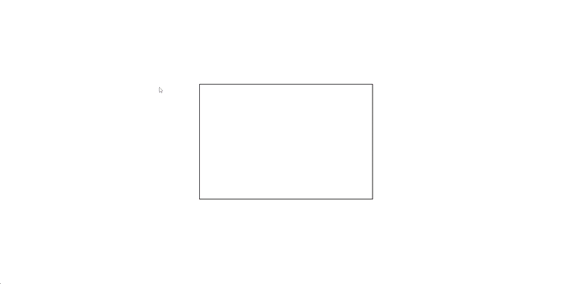

# Interactive Rectangle

Welcome to the Interactive Rectangle project! This is a simple web application that demonstrates interactive color change in a rectangle using HTML, CSS, and JavaScript with the GSAP (GreenSock Animation Platform) library.

## Table of Contents

- [Demo](#demo)
- [Description](#description)
- [Tech Stack](#tech-stack)
- [Installation](#installation)
- [Usage](#usage)

## Demo

You can experience the Interactive Rectangle in action [here](https://jain-rithik.github.io/Interactive-Rectangle/).

## Description

This project showcases an interactive rectangle that changes its background color based on the mouse position. When the mouse pointer moves from left to right within the rectangle, it transitions from red to blue, creating a visually engaging effect. When the mouse leaves the rectangle, it returns to its default white color.

## Tech Stack

- **Frontend**: HTML, CSS
- **JavaScript Library**: GreenSock Animation Platform (GSAP)

## Installation

1. Clone this repository to your local machine using `git clone`.
2. Navigate to the project directory.

## Usage

To run the Interactive Rectangle:

1. Open the `index.html` file in your web browser.

